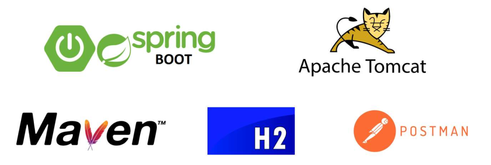
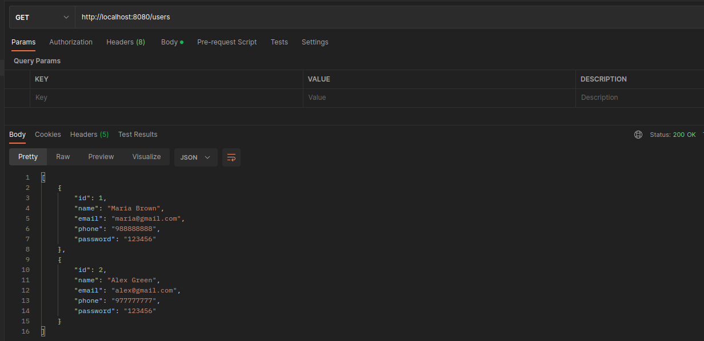
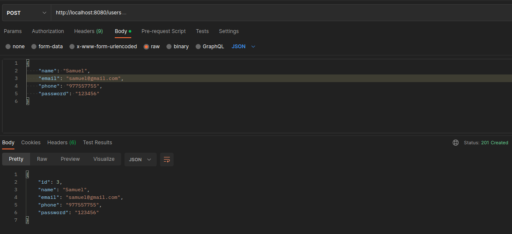
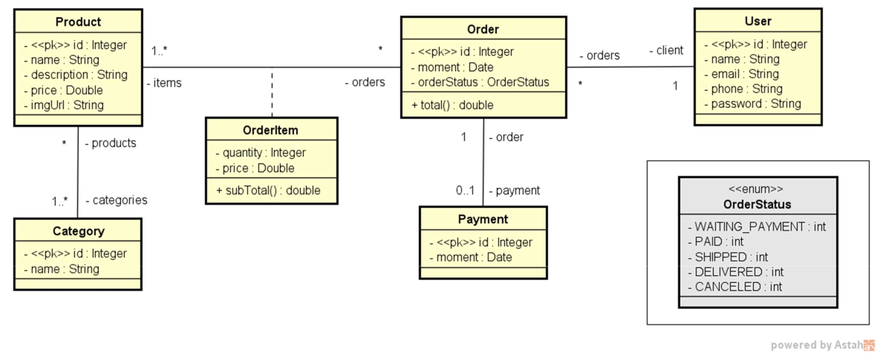
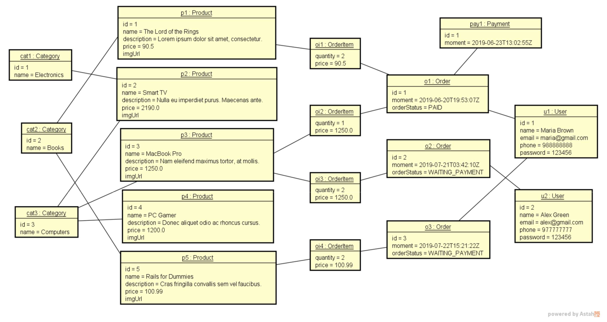

# API para serviço de usuários e pedidos
[](https://github.com/SamuelLost/springboot-project/blob/master/LICENSE) 

# Sobre o projeto

# Tecnologias utilizadas
## Back end
- Java
- Spring Boot
- JPA / Hibernate
- Maven
- Banco de dados: H2 Database

## Requisições para API
- Postman



## Modelo de Requisições
### Endpoints

- GET /users

- GET /users/{id}

- POST /users

- PUT /users/{id}

- DELETE /users/{id}

- GET /orders

- GET /orders/{id}

- GET /categories

- GET /categories/{id}

### Exemplo de requisição - GET /users



### Exemplo de requisição - POST /users



## Modelo conceitual


## Modelo de Instâncias


# Como executar o projeto

## Back end
Pré-requisitos: Java 17

```bash
# Clonar o repositório
git clone https://github.com/SamuelLost/springboot-project.git

# Entrar na pasta do projeto
cd springboot-project

# Executar o projeto
./mvnw spring-boot:run
```


# Autor

Samuel Henrique Guimarães Alencar

https://www.linkedin.com/in/samuelhenrique15
